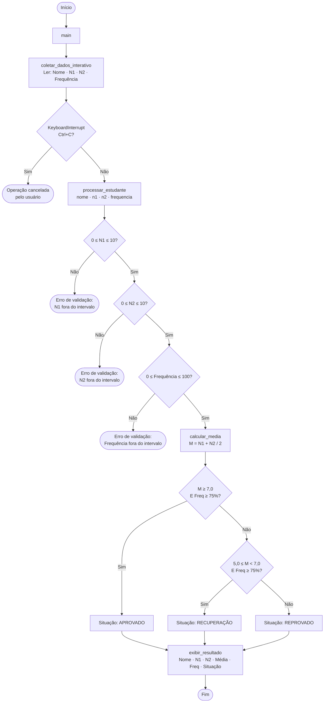

# Fluxograma — Assistente de Aprovação (EduLogic Sistemas)

## Legenda das funções

| Função                    | Responsabilidade                                              |
|---------------------------|---------------------------------------------------------------|
| `main`                    | Coordena o fluxo e trata exceções (`ValueError`, `KeyboardInterrupt`) |
| `coletar_dados_interativo` | Lê nome, N1, N2 e frequência via teclado                    |
| `validar_nota`            | Verifica se a nota está entre 0,0 e 10,0                     |
| `validar_frequencia`      | Verifica se a frequência está entre 0% e 100%                |
| `calcular_media`          | Calcula M = (N1 + N2) / 2                                    |
| `determinar_situacao`     | Aplica as regras de aprovação, recuperação e reprovação       |
| `exibir_resultado`        | Formata e imprime os dados finais do estudante                |

## Regras de negócio

| Condição                                  | Situação      |
|-------------------------------------------|---------------|
| Média ≥ 7,0 **e** Frequência ≥ 75%        | Aprovado      |
| 5,0 ≤ Média < 7,0 **e** Frequência ≥ 75% | Recuperação   |
| Qualquer outro caso                        | Reprovado     |
