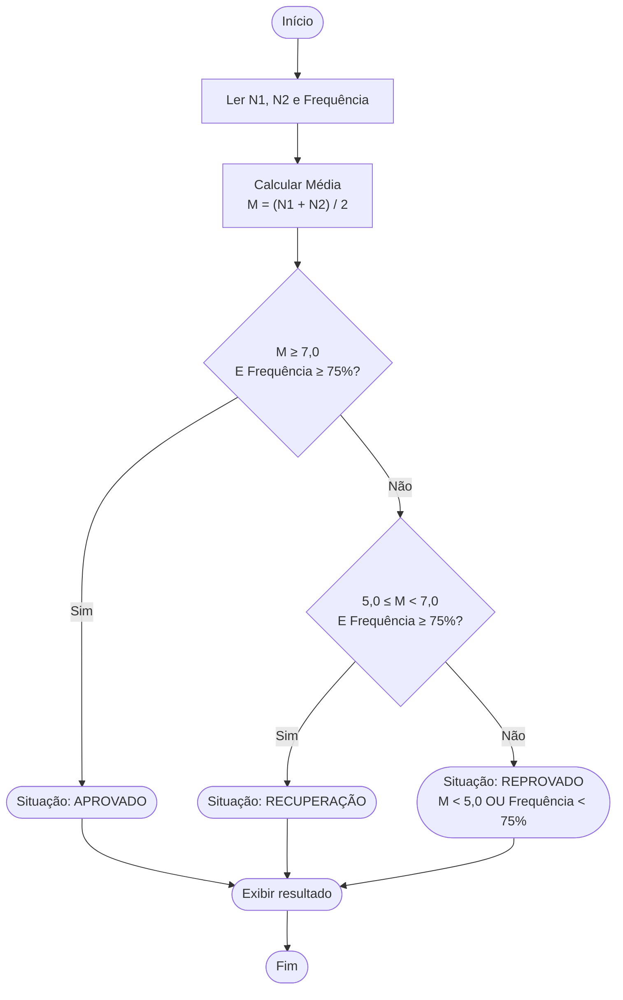

# Fluxograma da Atividade — Assistente de Aprovação

## Fluxograma



---

## Conectivos Lógicos nas Condições

Os conectivos lógicos **E**, **OU** e **NÃO** aparecem diretamente nas regras de negócio do módulo. A tabela abaixo mostra onde e como cada um é aplicado.

### E (conjunção — AND)

Exige que **todas** as condições sejam verdadeiras ao mesmo tempo.

| Regra        | Condição com E                                  |
|--------------|-------------------------------------------------|
| Aprovado     | `M ≥ 7,0` **E** `Frequência ≥ 75%`             |
| Recuperação  | `5,0 ≤ M < 7,0` **E** `Frequência ≥ 75%`       |

> Um estudante com média 8,0 mas frequência de 60% **não é aprovado**, porque a segunda condição falha. As duas precisam ser verdadeiras.

---

### OU (disjunção — OR)

Basta que **uma** das condições seja verdadeira para o resultado ser atingido.

| Regra     | Condição com OU                                  |
|-----------|--------------------------------------------------|
| Reprovado | `M < 5,0` **OU** `Frequência < 75%`              |

> Um estudante com média 3,0 e frequência 90% já é reprovado pela primeira condição, mesmo sem avaliar a segunda. Qualquer uma basta.

---

### NÃO (negação — NOT)

Inverte o valor lógico de uma condição. Nas regras da atividade ele aparece de forma implícita: a situação **Reprovado** é definida pela negação dos critérios de Aprovado e Recuperação.

| Forma explícita (equivalente)                                             |
|---------------------------------------------------------------------------|
| `NÃO (M ≥ 7,0 E Freq ≥ 75%)` **E** `NÃO (5,0 ≤ M < 7,0 E Freq ≥ 75%)` |

Pela **Lei de De Morgan**, isso é equivalente a:

```
(M < 7,0 OU Freq < 75%) E (M < 5,0 OU M ≥ 7,0 OU Freq < 75%)
```

Na prática, simplifica-se para a regra direta já utilizada:

```
M < 5,0  OU  Frequência < 75%
```

---

### Resumo

| Situação    | Conectivo principal | Expressão lógica                          |
|-------------|---------------------|-------------------------------------------|
| Aprovado    | **E**               | `M ≥ 7,0 E Freq ≥ 75%`                   |
| Recuperação | **E**               | `5,0 ≤ M < 7,0 E Freq ≥ 75%`             |
| Reprovado   | **OU**              | `M < 5,0 OU Freq < 75%`                  |
